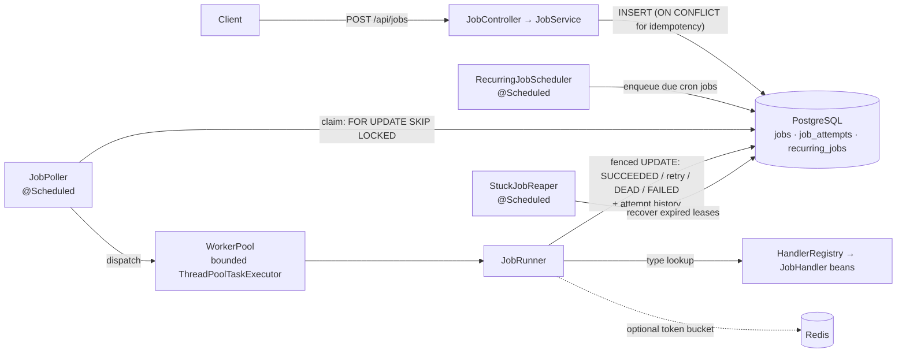
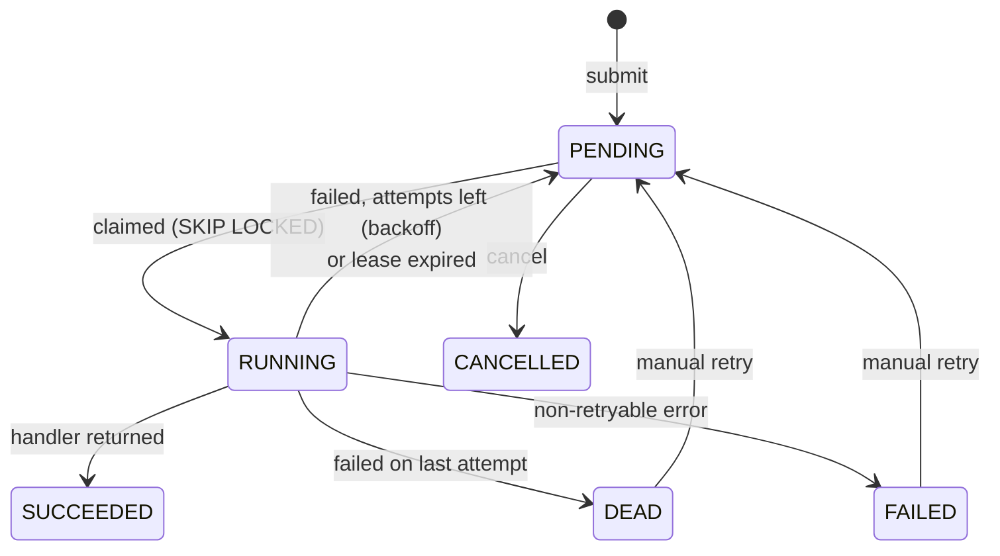

# Job Scheduler & Task Queue

[](https://github.com/kavya-tantuvay/job-scheduler/actions/workflows/ci.yml)


A **database-backed job queue** built with Java 17 and Spring Boot. Applications hand it slow or
unreliable work (sending emails, delivering webhooks, generating reports) over a REST API, and a
pool of workers runs that work in the background with **automatic retries, exponential backoff,
dead-lettering, idempotent submission and cron scheduling**. Developers don't have to write any
threading or retry code themselves.

The queue is a PostgreSQL table. Workers claim jobs with `SELECT … FOR UPDATE SKIP LOCKED`, so any
number of worker instances can share it safely: **no job attempt is ever run by two workers at
once**. A multi-worker concurrency test checks this on every CI run.

---

## Highlights

| | |
|---|---|
| **Safe concurrent claiming** | Transactional `FOR UPDATE SKIP LOCKED` claim; every state change is a guarded `UPDATE` fenced on the claim (`locked_by` + attempt number), so a worker whose claim was taken away can't overwrite anything |
| **Bounded worker pool** | Fixed-size `ThreadPoolTaskExecutor` with a bounded buffer; the poller claims only as many jobs as there are free slots (tracked exactly with a semaphore) |
| **Retries & dead-letter queue** | Exponential backoff with jitter, retryable vs. permanent failures, `DEAD` state with the full per-attempt error history and stack traces, one-call redrive |
| **Crash recovery** | Jobs whose worker died mid-run are detected by lease expiry and re-queued. A job that keeps crashing its workers is dead-lettered instead of looping forever |
| **Idempotency** | `Idempotency-Key` header; concurrent duplicates are resolved by a unique index with `INSERT … ON CONFLICT DO NOTHING` |
| **Recurring jobs** | Cron schedules fired exactly once per time slot across instances, with a configurable policy for time slots missed during downtime |
| **Graceful shutdown** | On SIGTERM: stop claiming, finish in-flight jobs, and put anything unfinished back in the queue without using up one of its attempts |
| **Redis rate limiting** | Optional cluster-wide per-type token bucket (atomic Lua script) to protect downstream APIs |
| **Observability** | Micrometer metrics (queue depth, pickup latency, execution time/throughput), Actuator health, `/api/jobs/stats` |
| **Quality** | 64 unit tests + 32 integration tests on real PostgreSQL/Redis via **Testcontainers**, multi-stage **Docker** image, **GitHub Actions** CI with a compose smoke test, and a benchmark harness that reports only measured numbers |

**Tech stack:** Java 17 · Spring Boot 3.5 (Web, Data JPA, Validation, Actuator, Scheduling) · Hibernate ·
PostgreSQL 16 · Flyway · Redis 7 (Lettuce) · Micrometer · springdoc-openapi (Swagger UI) · JUnit 5 ·
Mockito · Testcontainers · Awaitility · Maven · Docker · GitHub Actions

---

## Quick start

You only need Docker. This starts PostgreSQL, Redis and the application:

```bash
git clone https://github.com/kavya-tantuvay/job-scheduler.git
cd job-scheduler
docker compose up --build
```

**Enqueue your first job** (one call), then **check on it** (a second call):

```bash
curl -X POST http://localhost:8080/api/jobs \
  -H 'Content-Type: application/json' \
  -H 'Idempotency-Key: welcome-email-42' \
  -d '{"type": "log", "payload": {"message": "hello"}, "priority": 5}'

curl http://localhost:8080/api/jobs/{id}
```

```json
{
  "id": "e11f9e78-3dd1-41fd-be8a-ddb99882e0c5",
  "type": "log",
  "payload": { "message": "hello" },
  "status": "SUCCEEDED",
  "priority": 5,
  "attempts": 1,
  "maxAttempts": 3,
  "runAt": "2026-09-18T15:41:56.912725Z",
  "lockedAt": "2026-09-18T15:41:57.341524Z",
  "lockedBy": "HP-8252-65ceaa26",
  "lastError": null,
  "idempotencyKey": "welcome-email-42",
  "createdAt": "2026-09-18T15:41:56.932885Z",
  "updatedAt": "2026-09-18T15:41:57.429176Z"
}
```

Sending the same request again with the same `Idempotency-Key` returns this job (`200` +
`Idempotent-Replayed: true`) instead of creating a duplicate.

**Interactive API docs (Swagger UI):** <http://localhost:8080/swagger-ui.html>, where you can
submit, list, filter and inspect jobs from the browser.

### See retries and the dead-letter queue

```bash
# A job that always fails: retried with backoff, then dead-lettered
curl -X POST http://localhost:8080/api/jobs -H 'Content-Type: application/json' \
  -d '{"type": "flaky", "payload": {"failUntilAttempt": 99}, "maxAttempts": 3}'

curl 'http://localhost:8080/api/jobs?status=DEAD'        # the dead-letter queue
curl http://localhost:8080/api/jobs/{id}/attempts         # why it failed, attempt by attempt
curl -X POST http://localhost:8080/api/jobs/{id}/retry    # redrive once the problem is fixed
```

```json
[
  { "attempt": 1, "outcome": "FAILED", "workerId": "HP-8252-65ceaa26", "durationMs": 2,
    "error": "java.lang.IllegalStateException: Simulated transient failure on attempt 1",
    "stackTrace": "java.lang.IllegalStateException: Simulated transient failure on attempt 1\n\tat com.jobscheduler.worker.handlers.FlakyJobHandler.handle(...)" },
  { "attempt": 2, "outcome": "FAILED", "...": "..." },
  { "attempt": 3, "outcome": "FAILED", "...": "..." }
]
```

### Adding your own job type

A job type is just a Spring bean. Nothing in the queue itself needs to change:

```java
@Component
public class SendEmailHandler implements JobHandler {

    @Override
    public String type() {
        return "email.send";
    }

    @Override
    public void handle(JobContext job) {
        String to = job.payload().path("to").asText();
        if (to.isBlank()) {
            throw new NonRetryableJobException("payload.to is required"); // FAILED, no retries
        }
        mailClient.send(to, job.payload().path("template").asText()); // any exception -> retried with backoff
    }
}
```

Built-in types: `log`, `sleep`, `flaky` (for demos) and `webhook` (POSTs JSON to a URL with an
`Idempotency-Key` header; 5xx/408/429 are retried, other 4xx fail permanently).

---

## Architecture



Each application instance runs the same components, and all instances share one database.
Scaling out means starting more instances: they coordinate purely through row locks, with no
leader election and no broker.

**Job lifecycle**



### How claiming works

Workers claim jobs with a single SQL statement, inside a transaction:

```sql
WITH due AS (
    SELECT id FROM jobs
     WHERE status = 'PENDING' AND run_at <= now()
     ORDER BY priority DESC, run_at
     LIMIT :limit
       FOR UPDATE SKIP LOCKED          -- lock these rows; skip rows another worker has locked
)
UPDATE jobs j
   SET status = 'RUNNING', attempts = j.attempts + 1, locked_at = now(), locked_by = :workerId
  FROM due WHERE j.id = due.id
RETURNING j.*;
```

- `FOR UPDATE` locks the selected rows until the transaction commits. `SKIP LOCKED` makes other
  workers **skip** those rows instead of blocking on them, so concurrent pollers each get a
  *different* batch and never wait for each other.
- The rows are flipped to `RUNNING` **in the same transaction** that locked them. By the time the
  locks are released at commit, the rows no longer match `status = 'PENDING'`, so nobody can
  claim them again. (A `SELECT` and a separate `UPDATE` in auto-commit mode would leave a gap
  in which two workers could grab the same job.)
- The `(status, run_at, priority)` index lets the query find due jobs without scanning the table.

**Fencing.** Every later update for a job is conditional on the claim that is still valid:
`… WHERE id = ? AND status = 'RUNNING' AND locked_by = :me AND attempts = :myAttempt`. Suppose a
worker stalls, its lease expires and the job is handed to someone else. When the stalled worker
wakes up, its update matches 0 rows and its result is discarded. The attempt-history row is
written in the same transaction, so each attempt is recorded exactly once.

**Delivery guarantee, precisely:** no job attempt is ever executed by two workers at the same time,
and no job is lost. If a worker *crashes* mid-job, the job is run again (that's the only way to
finish it), so handlers should be idempotent. This is the standard trade-off for queues. The
webhook handler, for example, sends the job id as an `Idempotency-Key` so the receiver can
de-duplicate.

### Reliability features

- **Retries:** delay = `min(maxDelay, base × 2^(attempt−1))` with *equal jitter* (a uniform draw
  from the upper half of that range). Backoff gives a failing dependency room to recover. Jitter
  spreads out jobs that failed together, so they don't retry in synchronised waves.
- **Stuck-job recovery:** `locked_at` is treated as a lease. A reaper (safe to run on every instance
  thanks to `SKIP LOCKED`) returns jobs held past `jobs.reaper.lease-timeout` to the queue, and
  records a `LEASE_EXPIRED` attempt.
- **Graceful shutdown:** on context close the poller stops claiming, then the pool drains running
  and buffered jobs for up to `jobs.worker.drain-timeout`. Anything still running is interrupted
  and handed back to the queue without using up an attempt. `docker stop` triggers this, because
  the JVM runs as PID 1.
- **Backpressure:** the poller never claims more than the pool has room for. Under a backlog it
  keeps claiming as slots free up instead of waiting for the next poll interval. (The benchmark
  exposed that bottleneck; see `perf:` in the history.)
- **Recurring jobs:** due cron definitions are locked with `SKIP LOCKED`. The job is enqueued and
  `next_run_at` is advanced in one transaction, so a scheduled time slot can't be skipped or
  enqueued twice, however many instances are running. Time slots missed during downtime are
  either merged into one run (`FIRE_ONCE`) or dropped (`SKIP`).

---

## API

| Method | Path | Description |
|---|---|---|
| `POST` | `/api/jobs` | Submit a job (`type`, `payload`, `priority`, `maxAttempts`, `runAt`); optional `Idempotency-Key` header |
| `GET` | `/api/jobs/{id}` | Status, attempts, last error |
| `GET` | `/api/jobs?status=&type=&page=&size=&sort=` | List and filter (`?status=DEAD` is the dead-letter queue) |
| `GET` | `/api/jobs/{id}/attempts` | Per-attempt history: worker, timing, outcome, error, stack trace |
| `POST` | `/api/jobs/{id}/cancel` | Cancel a job that hasn't started |
| `POST` | `/api/jobs/{id}/retry` | Re-queue a `DEAD`/`FAILED` job with extra attempts |
| `GET` | `/api/jobs/stats` | Counts by status, due backlog, age of the oldest due job |
| `POST` | `/api/recurring` | Define a cron schedule (`name`, `type`, `payload`, `cron`) |
| `GET` | `/api/recurring`, `/api/recurring/{id}` | List / get schedules |
| `POST` | `/api/recurring/{id}/pause`, `/resume` | Pause or resume a schedule |
| `DELETE` | `/api/recurring/{id}` | Delete a schedule |
| `GET` | `/swagger-ui.html`, `/actuator/health`, `/actuator/metrics` | Docs and operations |

All errors share one shape:
`{"timestamp", "status", "error", "message", "path", "fieldErrors": [...]}`.

**Metrics** (`/actuator/metrics/<name>`): `jobs.queue.depth{status}`, `jobs.queue.due`,
`jobs.queue.oldest.due.age`, `jobs.queue.wait{type}` (pickup latency),
`jobs.execution{type,outcome}` (its count over time is throughput), `jobs.rate.limited{type}`,
`jobs.workers.in.flight`, plus executor, JVM and HikariCP metrics.

---

## Testing

```bash
./mvnw verify          # 64 unit tests + 32 integration tests (Docker needed for Testcontainers)
```

- **Unit tests** (JUnit 5, Mockito): backoff ceilings and jitter bounds, allowed/forbidden status
  transitions, handler registry validation, cron evaluation across time zones, `JobService`
  rules (idempotent replay/conflict, cancel races), `JobRunner` outcome routing, and the webhook
  handler against a real in-process HTTP server.
- **Integration tests** against **real PostgreSQL 16 and Redis 7 containers** (Testcontainers):
  the full lifecycle (succeed, retry, dead-letter + redrive, permanent failure, crashed-worker
  recovery with the late result fenced out), recurring jobs, the REST contract, and the rate limiter.
- **The concurrency test** (`ConcurrencyIT`):
  - 16 threads released at once by a barrier claim from 2,000 jobs: the union is every job, with
    no duplicates.
  - 4 independent worker instances (own thread pool, poller and identity) process 1,000 jobs, 100
    of which fail once. Every attempt runs **exactly once** (1,100 executions, 1,100 history rows,
    zero duplicates), and every instance does work.
  - 32 concurrent submissions with one `Idempotency-Key` create one job.

No Docker? Point the integration tests at existing servers instead:
`TEST_DB_URL=jdbc:postgresql://localhost:5432/test TEST_REDIS_HOST=localhost ./mvnw verify`.

CI (GitHub Actions) runs `./mvnw verify` on every push. It then builds the Docker image, starts the
whole compose stack, runs a job end to end, checks the idempotent replay, and checks that
`docker stop` drains the worker pool gracefully.

---

## Benchmarks

`./mvnw verify -Pbenchmark` runs [`QueueBenchmark`](src/test/java/com/jobscheduler/benchmark/QueueBenchmark.java)
and prints numbers **measured from timestamps recorded in the database during the run**. Results
from one run on my development laptop (full output in [docs/benchmark-results.md](docs/benchmark-results.md)):

> Intel Core i5-1335U (12 logical cores), 16 GB RAM (about 1 GB free during the run), Windows 11,
> JDK 21 targeting Java 17, PostgreSQL 16 on the same machine with default durable settings.
> Worker "instances" are simulated in one JVM. A laptop, not a server: read these as relative numbers.

| Scenario | Result |
|---|---|
| Database baseline: single-row INSERT + COMMIT, 8 threads | 8,319 commits/s |
| Enqueue via `JobService` (8 client threads) | **3,214 jobs/s** |
| Drain backlog of no-op jobs: 1 instance × 8 threads | **835 jobs/s** |
| Drain backlog of no-op jobs: 4 instances × 8 threads | **2,112 jobs/s** |
| Drain 20 ms I/O-bound jobs: 8 threads (ceiling 400/s) | 247 jobs/s |
| Drain 20 ms I/O-bound jobs: 32 threads (ceiling 1,600/s) | 903 jobs/s |
| Latency at a steady 200 jobs/s, 100 ms poll interval | submit→start **p50 71 ms, p99 121 ms** |
| Latency at a steady 200 jobs/s, 1 s poll interval | submit→start p50 535 ms, p99 1,012 ms |

What the numbers show: throughput scales with more instances and threads (they share the queue
without blocking each other), and I/O-bound work is limited by pool size. Pickup latency is roughly
half the poll interval. Each job costs a few database round-trips (claim, result, and history row),
which is the price of durability.

---

## Design decisions & trade-offs

**Why a database-backed queue instead of Kafka/RabbitMQ or an in-memory `BlockingQueue`?**
An in-memory queue loses every job when the process dies and can't be shared between instances. A
broker adds a whole system to run, and still needs a database for job state, retries, history and
queries like "show me all dead jobs of type X". Keeping jobs in PostgreSQL gives durability, easy
inspection with SQL, and horizontal scaling through `SKIP LOCKED`, all with one dependency. It also
allows transactional enqueueing: a service that shares the database can insert a job in the same
transaction as the business data that produced it, so neither exists without the other. The cost is throughput: every state change is a database write, so this fits
thousands of jobs per second, not millions. Beyond that, or for event streaming with fan-out to
many consumers, Kafka or RabbitMQ is the better tool.

**Polling vs. push.** Workers poll on an interval (or continuously while there's a backlog), which
adds up to one poll interval of pickup latency when idle. PostgreSQL `LISTEN/NOTIFY` could wake
pollers immediately; polling was kept for simplicity and robustness.

**Leases without heartbeats.** A job's lease is fixed (`lease-timeout`, default 5 min), so it must be
longer than the slowest job. Heartbeats that extend the lease would allow unbounded job durations,
at the cost of an extra write per job every few seconds.

**Rate limiter fails open.** If Redis is down, jobs run unthrottled rather than stopping the whole
queue. The limiter protects downstream systems; it shouldn't become a second single point of failure.

---

## Configuration

Everything is under `jobs.*` in [`application.yml`](src/main/resources/application.yml), and most
settings can be overridden with environment variables.

| Property | Default | Meaning |
|---|---|---|
| `jobs.worker.pool-size` (`WORKER_POOL_SIZE`) | 8 | Worker threads per instance |
| `jobs.worker.queue-capacity` | 8 | Claimed jobs buffered in memory per instance |
| `jobs.worker.drain-timeout` | 30s | How long shutdown waits for in-flight jobs |
| `jobs.poller.interval` / `batch-size` | 1s / 10 | Poll interval and maximum claim size |
| `jobs.submission.default-max-attempts` | 3 | Attempts when a submission doesn't say |
| `jobs.retry.base-delay` / `max-delay` | 2s / 5m | Exponential backoff range |
| `jobs.reaper.lease-timeout` / `interval` | 5m / 30s | When a RUNNING job counts as abandoned |
| `jobs.recurring.misfire-policy` | `FIRE_ONCE` | `FIRE_ONCE` or `SKIP` for missed cron slots |
| `jobs.recurring.zone` | UTC | Time zone for cron expressions |
| `jobs.rate-limit.enabled` (`RATE_LIMIT_ENABLED`) | false | Enable Redis per-type limits |
| `jobs.rate-limit.per-second.<type>` | `webhook: 5` | Cluster-wide jobs/s for a type |
| `DB_URL`, `DB_USERNAME`, `DB_PASSWORD`, `REDIS_HOST` | local defaults | Connections |

Run locally without Docker for the app itself: `docker compose up postgres redis`, then
`./mvnw spring-boot:run`.

---

## Project structure

```
src/main/java/com/jobscheduler
├── job/          Job entity, JobStatus, JobRepository (claim & fenced transitions), JobQueue,
│                 JobService (submit/idempotency/cancel/retry), JobController, attempt history
├── worker/       JobPoller, WorkerPool, JobRunner, StuckJobReaper, GracefulShutdown,
│                 HandlerRegistry + JobHandler strategy, handlers/ (log, sleep, flaky, webhook)
├── retry/        RetryPolicy (backoff + jitter), sealed RetryDecision
├── schedule/     Recurring cron definitions, scheduler tick, catch-up policy
├── ratelimit/    Redis token-bucket limiter
├── metrics/      Micrometer instrumentation
├── config/       Executor, scheduling, OpenAPI, typed @ConfigurationProperties
└── common/       BaseEntity, ApiError, GlobalExceptionHandler
src/main/resources/db/migration   Flyway: V1 schema + queue index, V2 idempotency, V3 attempts
src/test/java                      Unit tests, Testcontainers integration tests, QueueBenchmark
```
